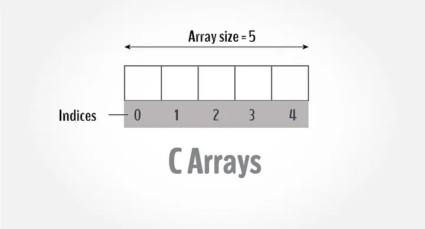

## L-10 Arrays, 1D 2D problems


<div style="max-width: 640px"><div style="position: relative; padding-bottom: 56.25%; height: 0; overflow: hidden;"><iframe src="https://iiitaphyd-my.sharepoint.com/personal/rc-support_iiit_ac_in/_layouts/15/embed.aspx?UniqueId=1defc217-dc5d-42d5-b9a5-3207ce689a6b&embed=%7B%22ust%22%3Atrue%2C%22hv%22%3A%22CopyEmbedCode%22%7D&referrer=StreamWebApp&referrerScenario=EmbedDialog.Create" width="640" height="360" frameborder="0" scrolling="no" allowfullscreen title="Computer Programming _ SH-2 (09.35AM-10.30AM)-20240828_050100-Meeting Recording.mp4" style="border:none; position: absolute; top: 0; left: 0; right: 0; bottom: 0; height: 100%; max-width: 100%;"></iframe></div></div>


--- 
 

---
Insertion Sort
```c
#include<stdio.h>
int main(){
  int arr[] = { 9, 6, 7, 2, 5, 8};
  int size = sizeof(arr) / sizeof(arr[0]);
  int i,j;
for (i = 1; i < size; i++) { // Start from 1 as arr[0] is always sorted
    int currentElement = arr[i];
     j = i - 1;
    // Move elements of arr[0..i-1], that are greater than key, 
    // to one position ahead of their current position
    while (j >= 0 && arr[j] > currentElement) {
      arr[j + 1] = arr[j];
      j = j - 1;}
     // Finally place the Current element at its correct position.
    arr[j + 1] = currentElement;
  }
  printf("Sorted Array: ");
  for (i = 0; i < size; i++){
    printf("%d ", arr[i]);}
  printf("\n");
  return 0;
      }
```
--- 
Bubble Sort
```c
#include<stdio.h>
int main()
{
  int arr[] = {3,2,6,5,4,7,8,9,10,1};
  int size = sizeof(arr)/sizeof(arr[0]);
  // loop over array elements
  for (int i = 0; i < size - 1; ++i) {
    // swapped variable initially set to 0  
    int swapped = 0;
    // loop to compare array elements
    for (int j = 0; j < size - i - 1; ++j) {
      // compare adjacent elements
      if (arr[j] > arr[j + 1]) {
        // swap if out-of-order
        int temp = arr[j];
        arr[j] = arr[j + 1];
        arr[j + 1] = temp;
        swapped = 1;
      }
    }
    if(swapped == 0) { break;}
  }
  printf("Sorted Array: ");
  for(int i = 0; i < size; i++)  {
        printf(" %d", arr[i]);
    }
  printf("\n");
  return 0;
        }
```
--- 
Selection Sort

```c
#include <stdio.h>
int main()
{ int n = 10;
  int a[] = {3,2,6,5,4,7,8,9,10,1};
  int min_index;
  for(int i = 0; i < n - 1; i++) {
    min_index = i;
    for(int j = i + 1; j < n; j++) 
    { if(a[min_index] > a[j]) {
          min_index = j;
        }
    }
    if(min_index != i)
    { int temp = a[i];
      a[i] = a[min_index];
      a[min_index] = temp;
    }
  }
  printf("Sorted Array: ");
  for(int i = 0; i < n; i++)  {
    printf(" %d", a[i]);}
  printf("\n");
  return 0;
            }
```
---
Leader in array
```c
#include<stdio.h>
int main()
{
    int arr[] = {21, 16, 17, 4, 6, 3, 5, 2};
    int n = sizeof(arr)/sizeof(arr[0]); // get the array length
    int max_from_right =  arr[n-1];
    printf("%d ", max_from_right);
    for (int i = n-2; i >= 0; i--)
    {
        if (max_from_right < arr[i])
        {          
            max_from_right = arr[i];    // 
            printf("%d ",max_from_right);
        }
    }
    printf("\n");
    return 0;
    } 
```
--- 
Insertion Sort: https://courses.iiit.ac.in/mod/resource/view.php?id=55407
Bubble Sort:    https://courses.iiit.ac.in/mod/resource/view.php?id=55408
Selection Sort: https://courses.iiit.ac.in/mod/resource/view.php?id=55409
Leader in Array: https://courses.iiit.ac.in/mod/resource/view.php?id=55410

Reading Material:

- https://www.youtube.com/watch?v=kPRA0W1kECg

- Knuth, Donald Ervin, 1938 - The art of computer programming / Donald Ervin Knuth. xiv,782 p. 24 cm.
- The Advantages & Disadvantages of Sorting Algorithms - Joe Andy - https://sciencing.com/the-advantages-disadvantages-of-sorting-algorithms-12749529.html

---
### Practice problems 1
- Write a C program to read and print elements of array.
- Write a C program to find sum of all array elements.
- Write a C program to find maximum and minimum element in an array.
- Write a C program to print all negative elements in an array.
- Write a C program to count total number of even and odd elements in an array.
- Write a C program to count total number of negative elements in an array.


--- 
### Practice problems 2

- Write a C program to copy all elements from an array to another array
- Write a C program to insert an element in an array.
- Write a C program to find reverse of an array.
- Write a C program to merge two array to third array.
- Write a C program to count total number of duplicate elements in an array.
- Write a C program to print all unique elements in the array.
- Write a C program to count frequency of each element in an array.
- Write a C program to put even and odd elements of array in two separate array.

--- 

### Practive Problem 3 
    1000 simple problems topic wise
- https://www.sanfoundry.com/c-programming-examples/