# Lecture 3  
### __Sandeep Nagar__
 

**Part-1**

_SSH, Autolab(pingala), pingala shell, Autograder_

**Part-2**

_Comments, Identifiers, Variables, Types, Constants, scanf, Controle Flow_ 
L-3 Slides: https://cpro-iiit.github.io/docs/course_material/lectures/3/lec_3.pdf

Programiz, web editor: https://tinyurl.com/bdd55vwn

---

## What is SSH, and how do I use it?

```bash
ssh sandeep.nagar@pingala.iiit.ac.in
```
- Connects to pingala server (at IIIT with Linux OS with all programs required for the course installed).
- Why?: All students will work in the same environment (os same, programs same, etc.)
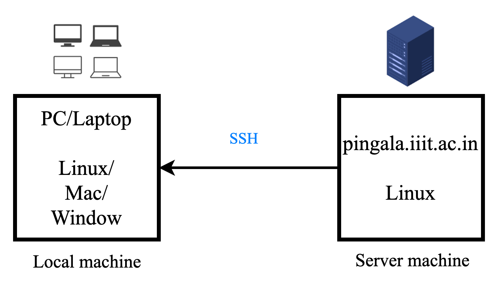
<!--  -->
<!-- - ![bg right:50% w:500] -->
<!-- `ssh-keygen` - creates a key pair for public key authentication -->

<!-- `ssh-copy-id` - configures a public key as authorized on a server -->

<!-- `ssh-agent` - agent to hold private key for single sign-on -->

<!-- `ssh-add` - tool to add a key to the agent -->
---
## Log in over SSH
    
    ssh user_name@pingala.iiit.ac.in
    Enter your CAS password

- You can work on the remote machine using your local computer.

- You can edit, create, and copy files on the server.
- Submit assessments using your local machine to Autolab.

---
<!-- ## Copying files using ssh shell.

`scp` - file transfer client with  command line interface (CLI)/terminal 
 - e.g. `scp main.c user@host:/path/to/destination` from local to server
 - `scp user@host:/path/to/source/file destination` from server to local
 - `scp main.c sandeep.nagar@pingala.iiit.ac.in:folder_name/` 
 - `scp sandeep.nagar@pingala.iiit.ac.in:main.c ./`
 - `sftp` - file transfer client with FTP-like command interface -->


<!-- --- -->


# Autolab: 
**For automatic evaluation and grading of programs.**

Two ways to submit, for auto-grading:
   
- pingala shell: using ssh shell (prefered)

- GUI: user interface, using pingala.iiit.ac.in website  
  
Questions about Autolab/ssh/pingala?

---

# Running the Program on shell

1. Run gcc compiler to get executable file `main`
        ```gcc main.c -o main```
2. Run the executable `main`
        ```./main``` 


<!-- --- -->
<!-- ## Using Makefile to do it together

1. Create a file `Makefile` (one-time step)
```make
// Makefile
run: 
 gcc main.c -o main
 ./main
```

2. run `make run` 

Next time, after you modify `main.c`, only `make run` needs to be done. -->

---
# Comments for C:

- Whole-line comment
- Partial line comment
- Multiple line comment
- 
            // This is a whole-line comment
            variable = 5; // this is partial line comment
            /* and 
            comment
            comment
            ..
            */          
    Programiz, web editor: https://tinyurl.com/bdd55vwn


---
# Identifiers: 
- Unique names that are assigned to variables, structs, functions, and other entities.
- Allow us to name data and other objects in the program.
- Each identifier object in the computer is stored at a unique address.

Rules to create identifiers:
- First character must be alphabetical or underscore '_'  
- Must contain only alphabetical characters, digits, or underscore
- The first 63 characters of an identifier are sufficient
- Can not duplicate a keyword
---

# E.g. for identifiers

    a               // valid
    my_name         // valid
    _your_name_     // valid 
    _Bool           // valid 
    _bool           // valid but not same as _Bool 
    Student Name    // invalid
    int             // not valid, int is a keyword
    char            // not valid, char is a keyword 
    2_name          // invalid, starting with digit
    I_am-Yoda       // invalid, '-' not allowed

---

# Constants:

Constants are data values that can not be changed during the execution of a program. Like variables, constants have a type.

Constant types:

- **Boolean, character, integer, real, complex, and string
constants.**
---

# Variables:

<!-- # scanf -->
    Void, Character, Integer

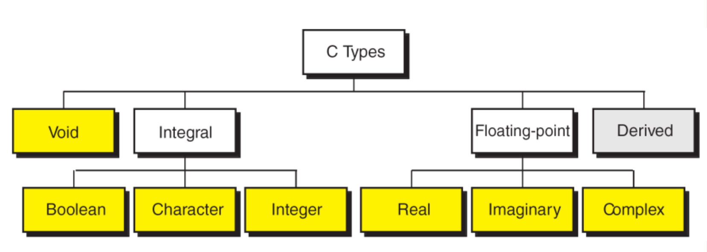

---
## Variable Initialization:

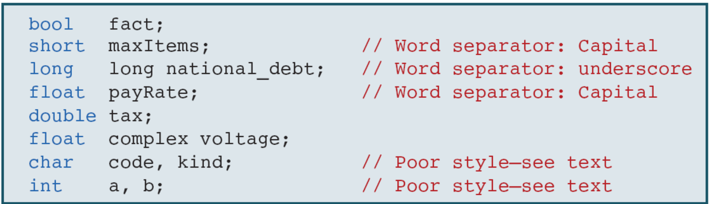 
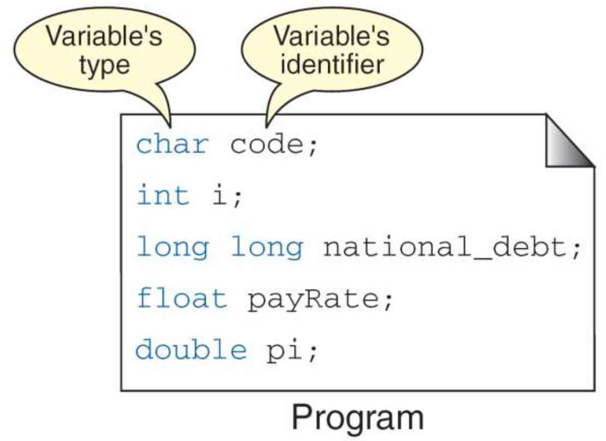

--- 
# Character Types:
    // char, 1 byte (= 8 bit)

    printf("%c", _char_)
<!-- wchar_t, 2 byte (16-bit) -->

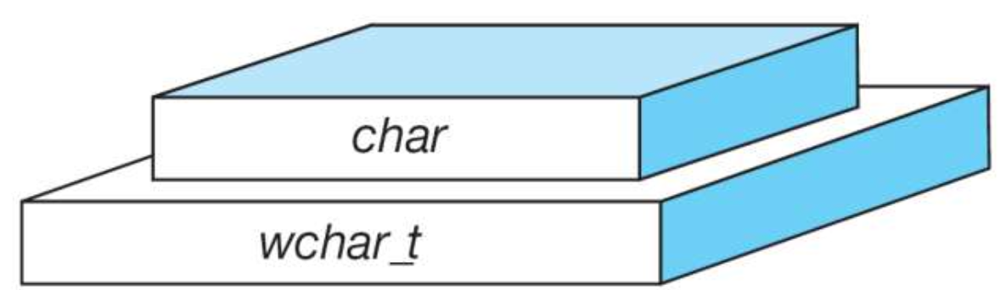

--- 
# Integer Types:
    
**short, int, long, long long**

- Size of integers 
  
        size of (short) ≤ size of (int) ≤ size of (long) ≤ size of (long long)
    
        2 byte -> 4 byte = 4 byte -> 8 byte

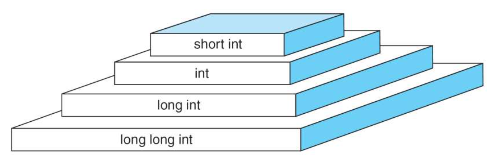 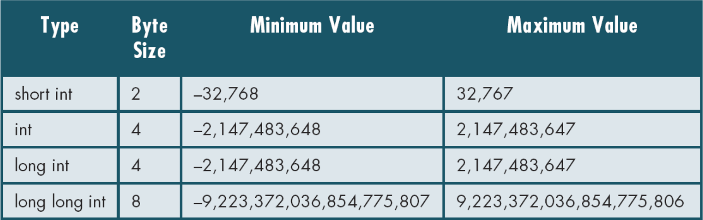

---
# Floating-point type:

- **float, double, long double**

        size of (float) ≤ size of (double) ≤ size of (long double) 
        4 byte -> 8 byte -> 16 byte


--- 

# Type summary:
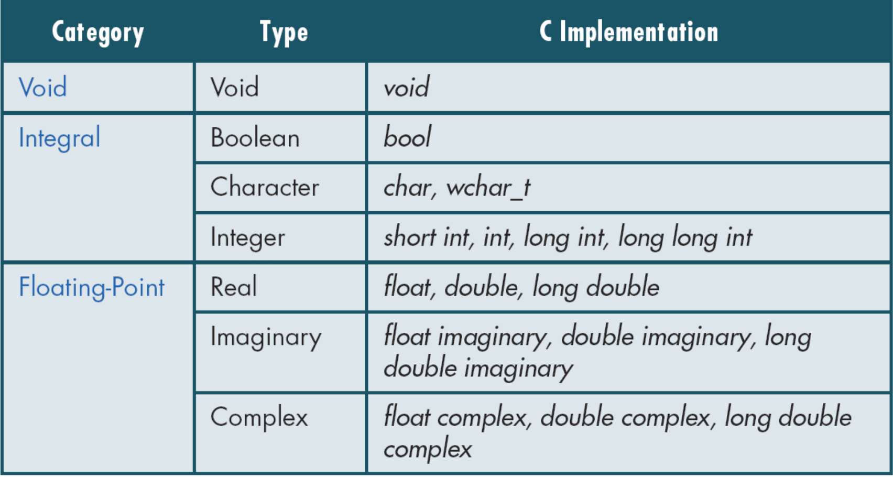 

---

# Type summary:
<!-- 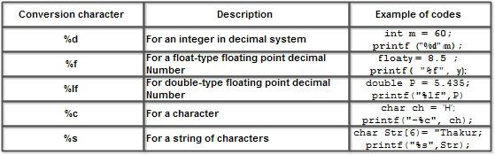 -->
<!-- 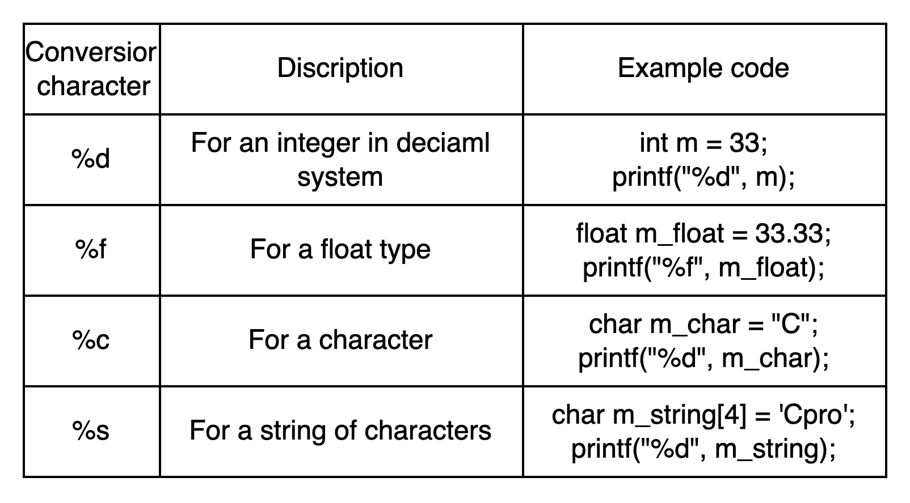 -->
<!-- 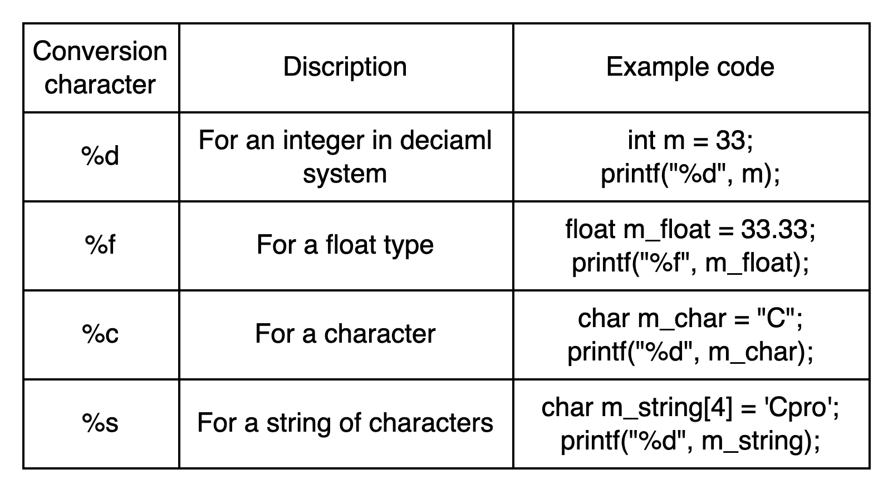 -->
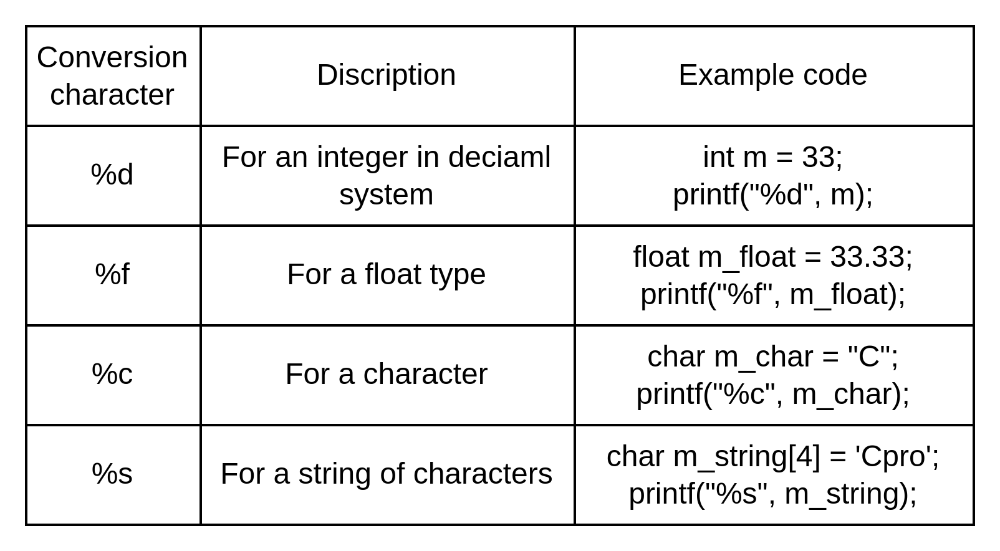


---
# Symbolic names for control characters
- Some common control characters along with their symbolic names:

      1.  Newline:           `\n`       printf("\n")
      2.  Horizontal tab:    `\t`       printf("\t")
      3.  Vertical tab:      `\v`       printf("\v")
      4.  Backspace:         `\b`       printf("\b")
      5.  Carriage return:   `\r`       printf("\r")
      6.  Form feed:         `\f`       printf("\f")
      7.  Alert (bell):      `\a`       printf("\a")
      8.  Backslash:         `\\`       printf("\\")
      9.  Single quote:      `\'`       printf("\'")
      10. Double quote:      `\"`       printf("\"")
      11. Question mark:     `\?`       printf("\?")
      12. Null character:    `\0`       printf("\0")

---
# scanf()

- Function reads data from the standard input stream stdin into the given locations.
- Reads `format-string` from left to right
        
 int a = 5;
 scanf("%d", &a);

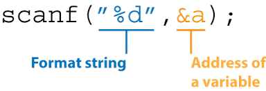

---
# scanf()
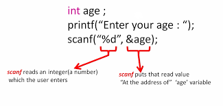


---
# scanf()
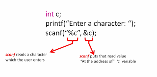

--- 
# scanf()

<!--  -->
<!-- 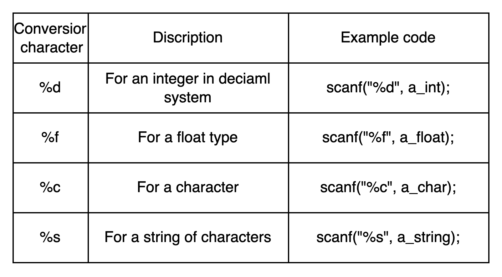 -->
<!-- 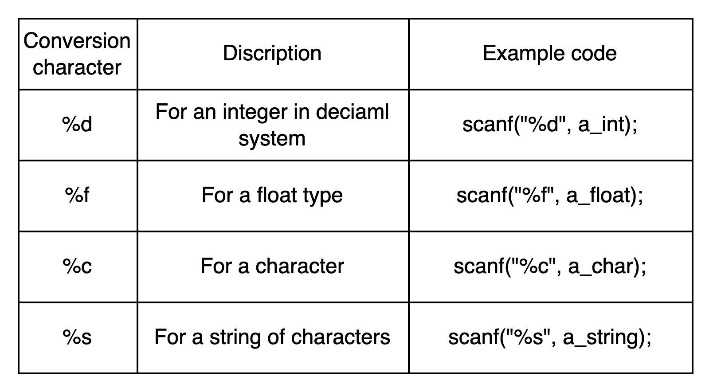 -->
<!-- 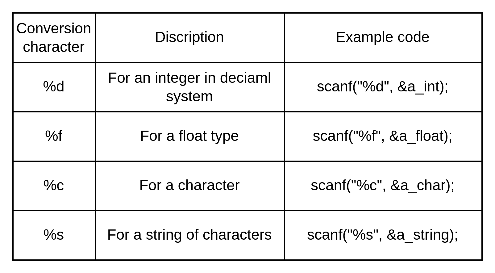 -->
<!-- 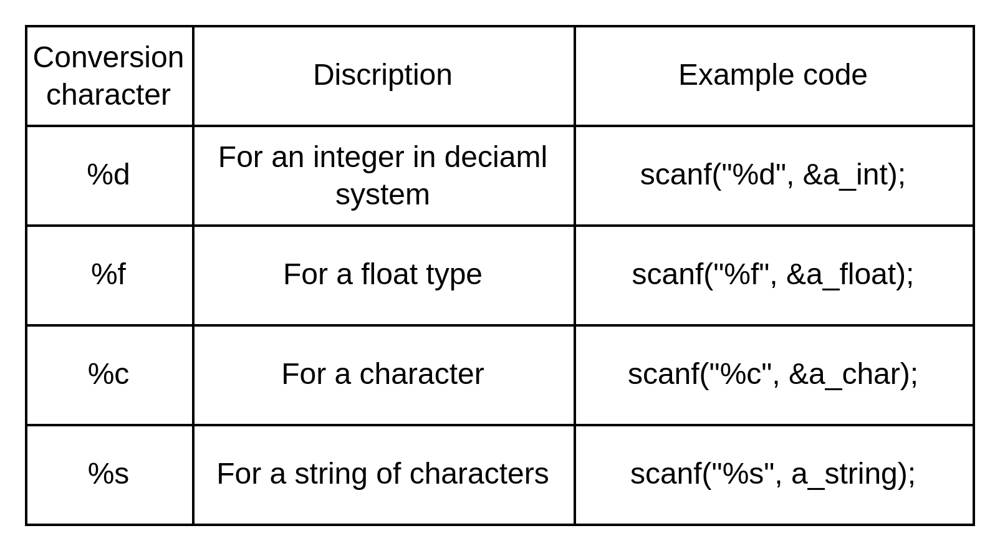 
 -->


---
# Contrlo Flow
  - Condition is an expression (or series of expressions)
 e.g. `n < 3 or x < y || z < y`
  - Operators Precedence and Associativity: some operations are done before others when evaluating an expression.
       
        Parentheses: ()                                 // first
        Postfix operators: ++, --
        Unary operators: +, -, !, ~, ++, --, (type)
        Multiplicative operators: *, /, %
        Additive operators: +, -
        Relational operators: <, >, <=, >=
        Equality operators: ==, !=
        Logical AND operator: &&
        Logical OR operator: ||
        Assignment operators: =, +=, -= ... and so on   // last 

---

# Associativity: 

When expressions contain operators of the same precedence level, their evaluation order is determined.
- Left-Associative: operators are evaluated from left to right, `+`, `+` 
  - e.g.`a + b - c` will first evaluate `a + b` and then subtract `c` from the result.

- Right-Associative: are evaluated from right to left, e.g. `=`
  - e.g. `a = b = c`, `c` is assigned to `b`, and then the resulting value of `b` is assigned to `a`.

**Crucial for correctly interpreting and writing C programming expressions.**
<!-- Experssions, Add, mul, div, 
Parity order 
ssh
datatypes
expression, operator precedence ()
variables
scanf -->
--- 

# Questions? 

---

# Reading 

**Next: Conditional Statements: if, else, while, switch, break, continue.**

- Chapter 3: Computer Science: A Structured Programming Approach Using C    Behrouz A. Forouzan, Richard F. Gilberg

- More about scanf : https://www.ibm.com/docs/en/i/7.4?topic=functions-scanf-read-data

- Programiz, web editor: https://tinyurl.com/bdd55vwn
- http://courses.washington.edu/mengr477/resources/Precedence.pdf

<!-- Order
spellings
less slides/ -->