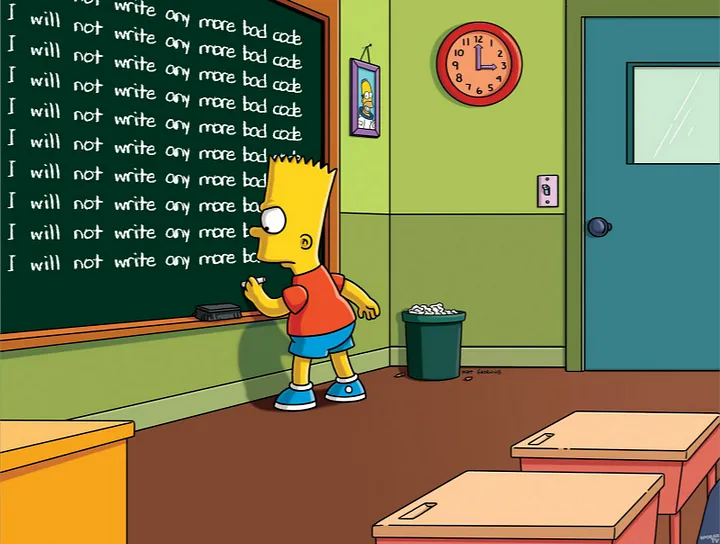

## writing pseudo code
-  Detailed yet readable description of what a computer program or algorithm must do, expressed in a formally-styled natural language rather than in a programming language.
- High-level description of an algorithm that uses the structural conventions of a programming language, but is intended for human reading rather than machine reading.
- Useful tool for planning and designing algorithms, as it allows you to focus on the logic and structure of the algorithm without getting bogged down in the details of a specific programming language.
---
- Pseudo code can be written in a variety of ways, but it typically uses a combination of English-like keywords and symbols to represent the steps of an algorithm.
- Not meant to be executed by a computer, but rather to help you plan and understand the logic of an algorithm before you write the actual code in a programming language.
- Can be used to describe algorithms for a wide range of problems, from simple arithmetic calculations to complex data processing tasks.
- Valuable tool for developers, as it can help you communicate your ideas and designs to others, as well as serve as a blueprint for writing code in a specific programming language.
- https://www.wikihow.com/Write-Pseudocode
- https://users.csc.calpoly.edu/~jdalbey/SWE/pdl_std.html 

---

### How to write pseudo code
- Start by defining the problem you want to solve and the steps you need to take to solve it.
- Break down the problem into smaller, more manageable sub-problems, and write pseudo code for each sub-problem.
- Use English-like keywords and symbols to represent the steps of the algorithm, such as "if", "else", "while", "for", "do", "end", and "return".
- write all the math required to solve the problem in pseudo code.
- write all the logic required to solve the problem in pseudo code.
- https://computersciencewiki.org/images/e/ea/Pseudo_Code_Practice_Problems.pdf
---
## Guide on writing clean and readable code 
Clean code is a term used to describe computer code that is easy to read, understand, and maintain. Here are some tips on writing clean and readable code:

1. Follow a consistent coding style and formatting guidelines.
2. Use meaningful and descriptive variable, function, and class names.
3. Break down complex tasks into smaller, more manageable functions or methods.
4. Write comments to explain the purpose and logic of your code.
5. Keep the code modular and reusable by avoiding duplication.
6. Ensure a clear flow of execution by organizing your code in a logical order.
7. Write unit tests to verify the correctness of your code.
8. Use version control to track changes and collaborate with others.
9. Continuously refactor and improve your code to eliminate redundancy and improve readability.

---
Effectiveness, efficiency and Simplicity

Remember, writing clean code is an ongoing process that requires attention to detail and continuous improvement.

--- 
### Effectiveness: guidelines we can follow

  - Does the code do what it is supposed to do?
  - Are there any bugs or unexpected behaviors?
  - Does the code follow the requirements and specifications?
  - Are there any edge cases that are not handled?
  - Is the code efficient in terms of memory and processing time?
  <!-- - Are there any security vulnerabilities or potential issues with the code? -->
  - Is the code easy to test and maintain?

---
### Efficiency: guidelines we can follow

  - Does the code perform well under different conditions?
  - Are there any bottlenecks or performance issues?
  - Are there any unnecessary loops, conditions, or operations?
  - Is the code optimized for speed and memory usage?
  - Are there any redundant or duplicate code blocks?
  - Are there any potential improvements that can be made to optimize the code?

---
 ### Simplicity: guidelines we can follow

  - Can you easily understand what the program does at each line?
  - Do functions and variables have names that clearly represent their responsibilities?
  - Is the code indented correctly and spaced with the same format all along the codebase?
  - Is there any documentation available for the code? Are comments used to explain complex parts of the program?
  - How quick can you identify in which part of the codebase are certain features of the program? Can you delete/add new features without the need of modifying many other parts of the code?
  - Does the code follow a modular approach, with different features separated in components?
  - Is code reused when possible? Are there any duplicated code blocks that can be refactored into a single function?
--- 
<!--  -->

1. Format and Syntax: Keep Functions and Methods Short, Consistent Formatting and Indentation, Use Meaningful Whitespace.

2. Re-usability: Minimize code duplication

3. Comments: Code should be self-explanatory whenever possible
Clear flow of exectuion 

4. Naming Variable: Meaningful Variable and Function Names, avoid global variables 
DRY (Don't Repeat Yourself) Principle 

--- 
Functions

```c
function(...) {
  // high level of abstraction 
   
  // intermediate level of abstraction 
  
  // low level of abstraction 
  
}
``` 
--- 
### Naming Conventions
- Use meaningful names for variables, functions, classes, and other identifiers.
- Avoid using single-letter variable names or abbreviations that are not clear or descriptive.
- Use camelCase or snake_case naming conventions for variables and functions.
- Use PascalCase naming conventions for classes and interfaces.
- Use descriptive names that reflect the purpose and behavior of the identifier.


--- 
### Comments

- Use comments to highlight assumptions or restrictions, to record any complex or non-obvious code logic, and explain the goals and usefulness of complicated algorithms.
- good idea to include comments in your code because it makes it easier to comprehend and maintain
- Effectively placed comments


---


